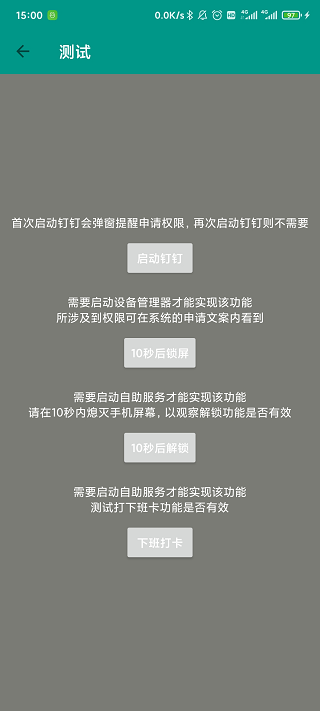
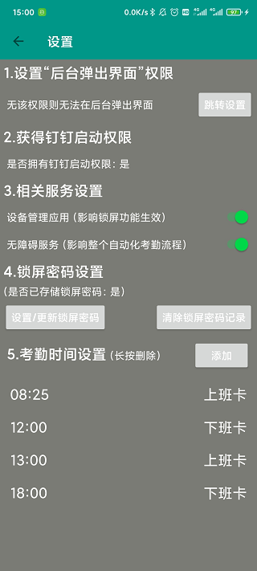
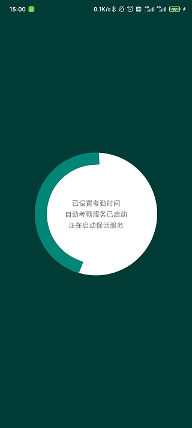

# self-service

本项目是基于 <b>MVVM + Jetpack</b> 设计模式和组件进行开发，主要通过无障碍服务来实现钉钉自动打卡功能，目前只适用于 MIUI 系统

### 效果演示

<h6>(到点唤醒屏幕并解锁，启动钉钉打卡后息屏，全程无手动操作)</h6>

### 屏幕截图

### 功能介绍
<ul>
<li>

在用户授予相关权限并设置了考勤时间及锁屏密码后，该 APP 将会在指定时间自动唤醒屏幕并解锁，并启动钉钉进行打卡，然后息屏直到下一个打卡时间

</li>
<li>

当今天所有打卡时间已过，自动停止前台服务，直到第二天凌晨将再次启动前台服务进行定时打卡

</li>
<li>

周末默认不启动定时打卡前台服务，此时如有需要可通自行启动服务，支持通过快捷方式启动

</li>
</ul>

### 具体实现
<ul>
<li>

通过  <a href="https://developer.android.google.cn/reference/android/os/PowerManager?hl=en">PowerManager</a> 唤醒屏幕

</li>
<li>

使用 <a href="https://github.com/Tencent/MMKV">MMKV</a> 库存储手机解锁密码及考勤数据

</li>
<li>

通过 <a href="https://developer.android.google.cn/reference/android/accessibilityservice/AccessibilityService?hl=en">AccessibilityService</a> 模拟用户操作进行自动化解锁和打卡

</li>
<li>

通过 <a href="https://developer.android.google.cn/reference/android/app/admin/DevicePolicyManager?hl=en">DevicePolicyManager</a> 息屏

</li>
<li>

通过用户给予 <b>自启动权限 + 启用无障碍服务</b> 的方式进行保活

</li>
</ul>

## 三方组件

### Android Jetpack 组件

* [Lifecycle: Create a UI that automatically responds to lifecycle events.](https://developer.android.com/topic/libraries/architecture/lifecycle)

* [LiveData: Build data objects that notify views when the underlying database changes.](https://developer.android.com/topic/libraries/architecture/livedata)

* [ViewModel: Store UI-related data that isn't destroyed on app rotations. Easily schedule asynchronous tasks for optimal execution.](https://developer.android.com/topic/libraries/architecture/viewmodel)

### 网络请求

* [Retrofit2: Type-safe HTTP client for Android and Java by Square, Inc.](https://github.com/square/retrofit)

* [OkHttp: An HTTP+HTTP/2 client for Android and Java applications.](https://github.com/square/okhttp)

### 依赖注入

* [Dagger-hilt: Dependency injection with Hilt](https://developer.android.com/training/dependency-injection/hilt-android)

### 其它

* [Glide: An image loading and caching library for Android focused on smooth scrolling](https://github.com/bumptech/glide)

* [Timber: A logger with a small, extensible API which provides utility on top of Android's normal Log class.](https://github.com/JakeWharton/timber)

* [MMKV: An efficient, small, easy-to-use mobile key-value storage framework used in the WeChat application.](https://github.com/Tencent/MMKV)

# Automatic_punch_pin_Demo
